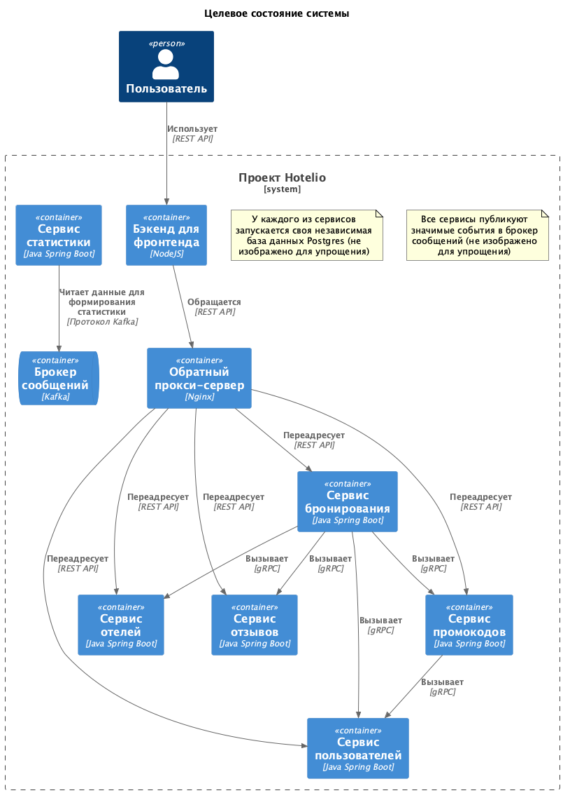
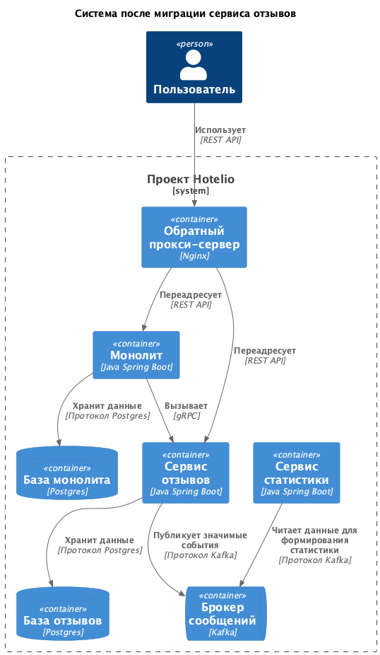

# ADR1: Проработка миграции от монолита к микросервисам

Автор: Кудрин О.А.
Дата: 07.09.2025

## Контекст

Проект Hotelio реализован как простой монолит. С ростом бизнеса возникли серьезные архитектурные и операционные проблемы. Принято решение о переходе на микросервисную архитектуру с постепенным выносом сервисов.

Текущие проблемы:
- Сложность сопровождения
- Низкая масштабируемость
- Невозможность гибкой разработки
- Ограничения на фронтенде
- Сложности с запуском новых фичей

## Требования

Решить возникшие проблемы:
- Упростить сопровождение
- Повысить масштабируемость
- Обеспечить независимую разработку
- Способствовать развитию фронтенда
- Снизить время выхода фичей

Также повысить отказоустойчивость.

## Решение

Предлагается следующая архитектура приложения.

Разбить приложение на пять сервисов соответственно внутренней структуре монолитного приложения. У каждого сервиса будет свой REST API. В качестве маршрутизатора применить обратный прокси-сервер Nginx. На входе поставить приложение Backend for Frontend на NodeJS, которое будет работать с сервисмами через прокси-сервер.

У каждого сервиса будет своя база данных Postgres. Внутренний обмен данными реализовать с помощью синхронных удаленных вызовов gRPC. Также реализовать в сервисах репликацию значимых событий в брокер сообщений Kafka, в частности информацию о бронированиях. Далее эта информация может быть использована в новом сервисе статистики.

Перерабатывать REST API отдельных сервисов не предполагается. Поэтому достаточно простого варианта с обратным прокси-сервером, который позволит объединить REST API отдельных сервисов.

Данное решение закроет все требования.

### План миграции на микросервисы

Предлагается использовать паттерн Strangler Fig для постепенно выделения микросервисов из монлита.

Последовательность действий:

1) Настраиваем обратный прокси-сервер. Переводим доступ к монолиту на прокси-сервер.

2) Отрабатываем механизм проброса вызовов из монолита наружу. Для этого будем использовать вызов удаленных процедур gRPC. Нужно научиться перенаправлять вызовы из компонентов монолита наружу на микросервисы.

3) Выносим первый микросервис, это будет сервис отзывов. Он не ссылается на другие сервисы, к нему есть обращение только из сервиса бронирования. Это позволит отработать методику на неключевом сервисе, возможные проблемы скажутся несущественно.

4) Затем выносим сервисы в следующем порядке: отели, пользователи, промокоды. Бронирование остается в монолите как отдельный микросервис (со временем почистить код от устарешей логики). При необходимости порядок миграции можно пересмотреть.

Еще до полного завершения миграции занимаемся следующими задачами:

5) Настраиваем брокер сообщений как средство репликации данных. Реализуем в микросервисах публикацию значимых событий. Создаем микросервис статистики.

6) Реализуем набор бэкендов для нужных фронтендов, и соответственно создаем новые версии фронтендов.

7) Налаживаем мониторинг и верификацию микросервисов.

### Промежуточное состояния

Для представления изображу состояние системы после выделения сервиса отзывов. При этом уже создан сервис статистики, но до бэкендов для фронтендов еще не дошло.

## Альтернативы

В качестве альтернативы был рассмотрен асинхронный вариант взаимодействия между микросервисами посредством брокера сообщений. Но сложность такого решения, в том числе в процессе миграции, не позволила его применить. Синхронное решение на основе gRPC вполне рабочее, а на перспекитиву в системе есть брокер сообщений, для начала он используется для сбора статистики, со временем можно будет задействовать его и для оперативной работы. Это может стать следующим этапом развития системы, уже разбитой на микросервисы.

## Недостатки, ограничения, риски

Недостатком выбранного решения является синхронная природа взаимодействия между сервисами, что ставит их в зависимое положение. Это обратная сторона относительной простоты решения. В перспективе возможно реализация более асинхронного варианта.
